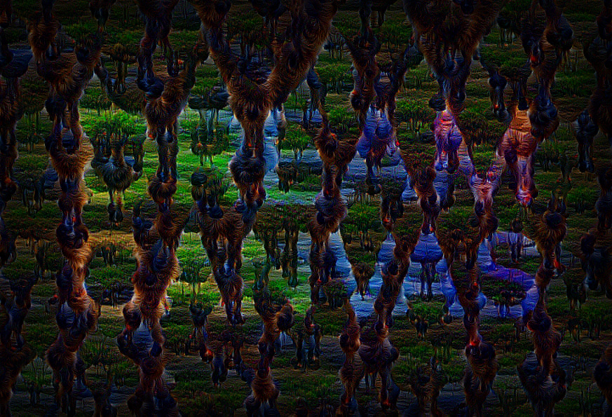

# DreamCanvas

DeepDream experiment, hosted here: https://dream.almost.digital

[](https://dream.almost.digital)

## Dependencies

  * Build-essentials (clang/gcc, make, etc.)
  * [python3](https://python.org)
  * [node.js + npm](https://nodejs.org) (version 7)
  * [TensorFlow](https://www.tensorflow.org) (version 1.1.0)
  * [sharp](https://github.com/lovell/sharp) (image processing with vips)
  * [node-canvas](https://github.com/Automattic/node-canvas) (canvas implementation with cairo)

Rest of the dependencies are listed in `package.json` and will be installed automatically.

## Running

Run these in separate terminal windows for best results.

### Dreamer service

```
make dreamer
```

This starts the python service that does the actual image processing.

### Websocket service

```
make server
```

Starts the node.js websocket server that manages the clients and submits the canvas for dreaming to the python service.

### Client

```
make preview
```

This starts the [wintersmith](http://wintersmith.io) preview server serving the web app in `client/`.
If you plan to host this somewhere you should run `make build` to build a static version of the client that can
be deployed to any webserver.

---

*Share and enjoy!*
